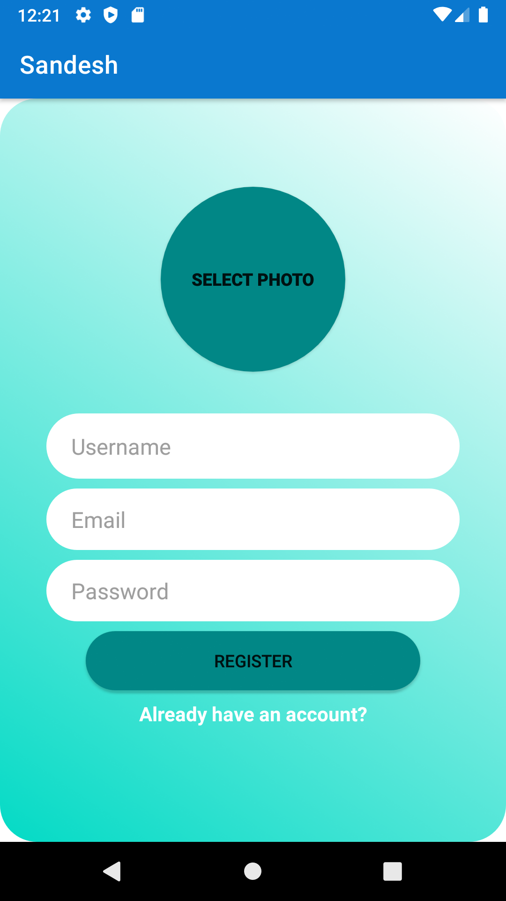
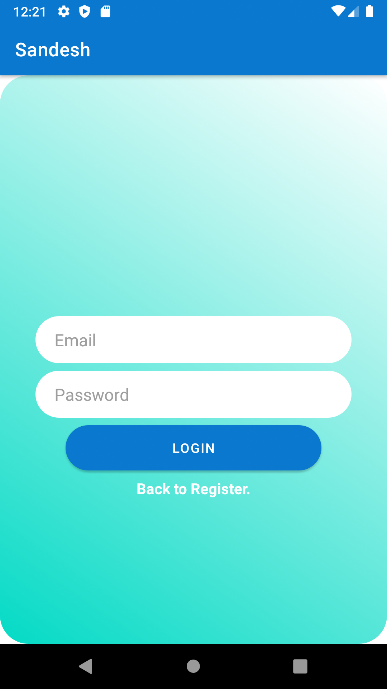
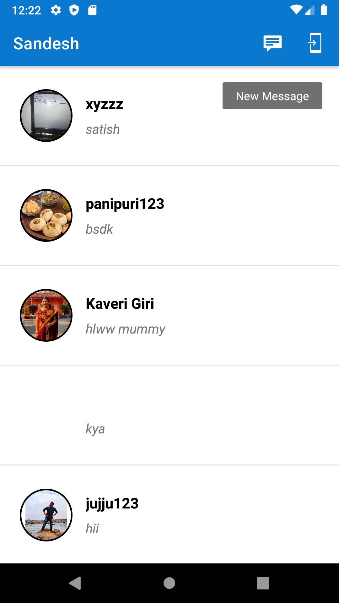
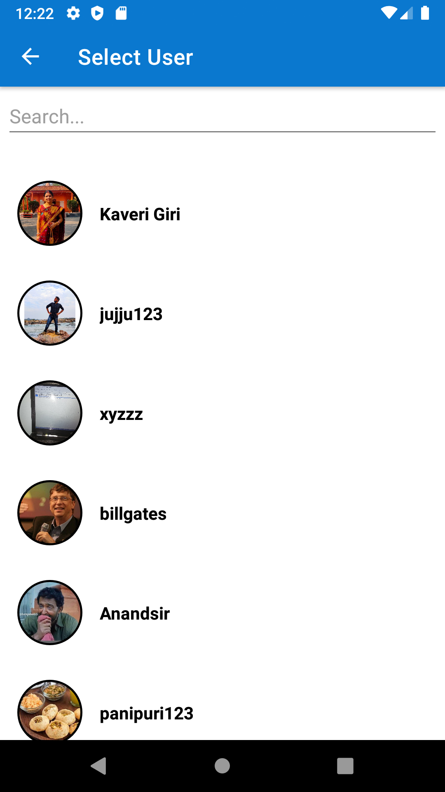
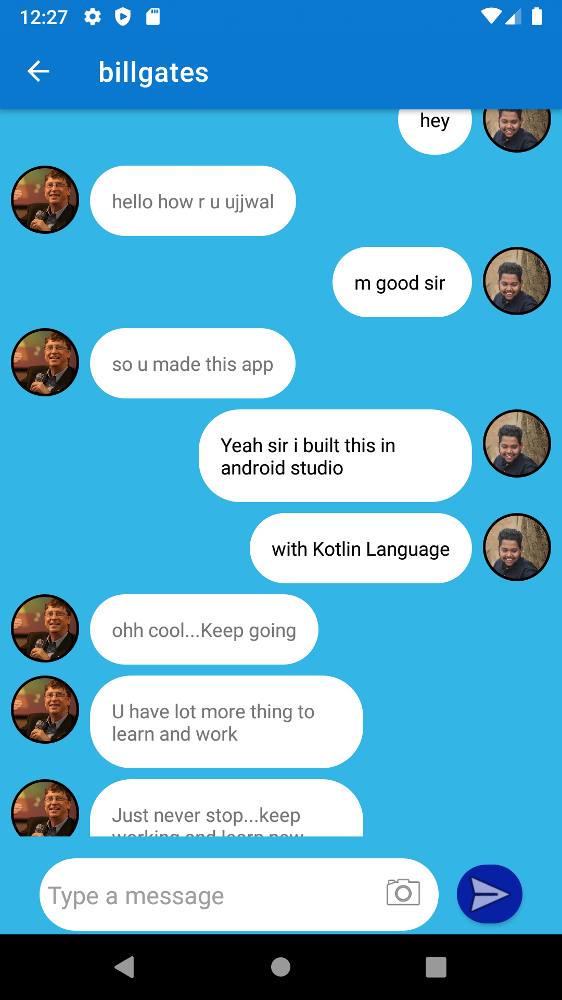

# Sandesh_Chat_Messenger_App
Sandesh is a simply chatting android app. 
#
Written in Kotlin language.
#
Platform on which the project is done - Android Studio.
#
Database and cloud based Storage used - Firebase.
#
# Libraries used :- 
                  Kotlin Standard Library.
                  ImagePicker - Image Editing.
                  Picasso - Image upload and fetch from FirebaseStorage.
                  CircularImageView.
                  FirebaseAuth.
                  xwray Groupie.
# Snapshots

                  
